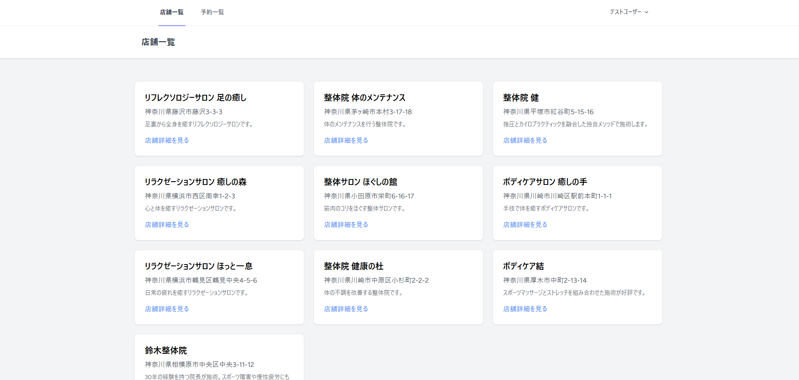
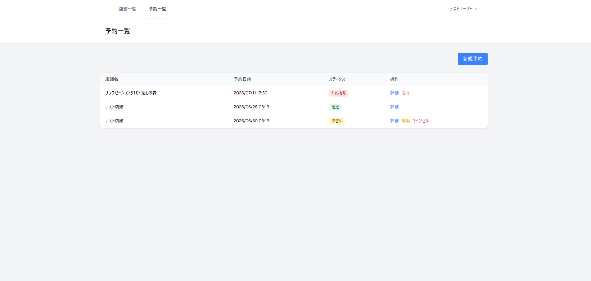
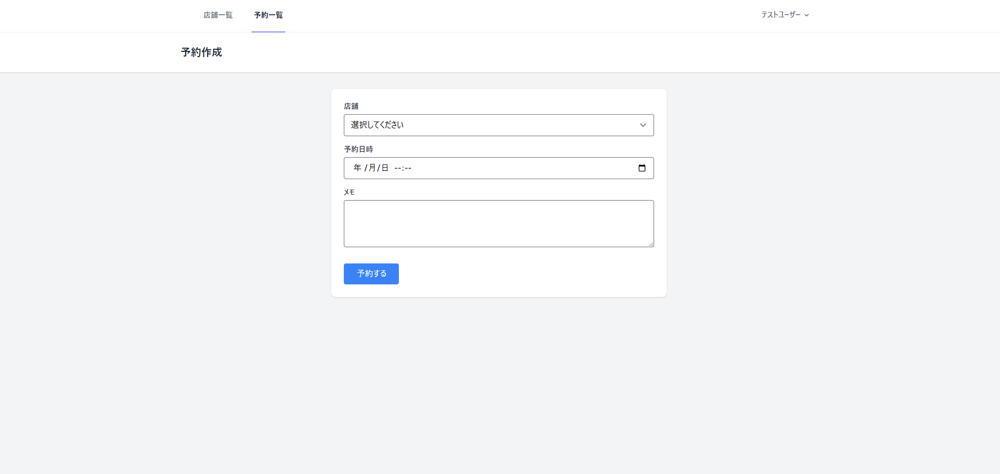
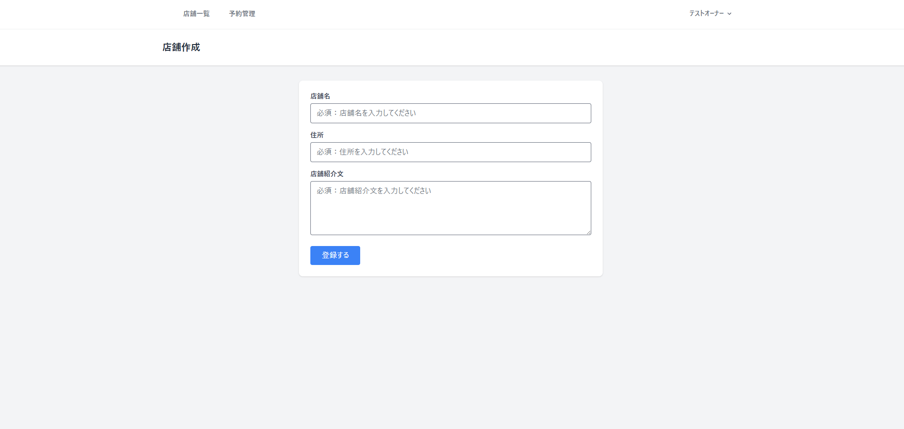
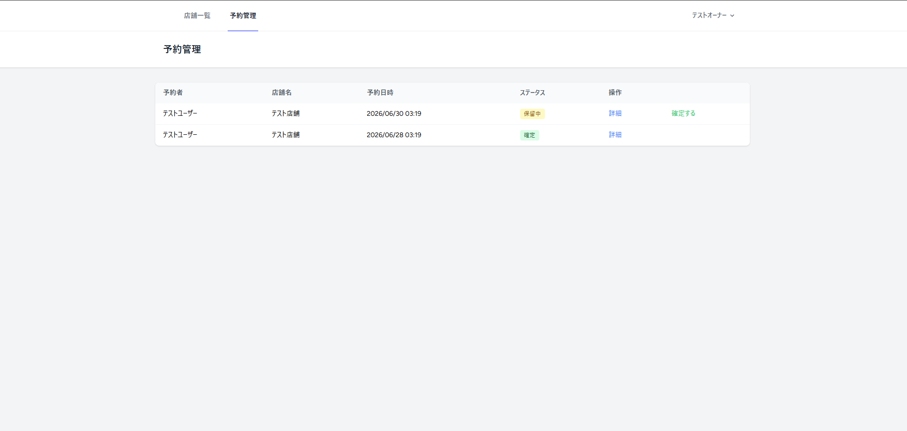
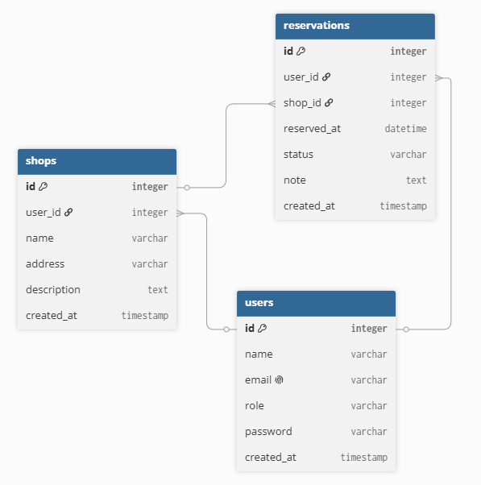

## 目次
- [マッサージ・整体サロン予約管理システム](#マッサージ整体サロン予約管理システム)
  - [デモ・テストアカウント](#デモテストアカウント)
  - [制作背景](#制作背景)
  - [主な機能](#主な機能)
    - [ユーザー側](#ユーザー側)
    - [オーナー側](#オーナー側)
  - [ER図](#er図)
  - [設計のポイント](#設計のポイント)
    - [ロール別権限管理](#ロール別権限管理)
    - [予約ステータスの遷移管理](#予約ステータスの遷移管理)
    - [FormRequestによるバリデーション](#formrequestによるバリデーション)
  - [技術スタック](#技術スタック)
  - [開発環境・開発フロー](#開発環境開発フロー)
  - [テスト](#テスト)
  - [今後の改善予定](#今後の改善予定)
  - [セットアップ手順](#セットアップ手順)

# マッサージ・整体サロン予約管理システム

ユーザーが店舗を選んで予約・管理でき、オーナーは店舗を登録してユーザーからの予約を管理できるWebアプリです。

## デモ・テストアカウント

| 項目 | 内容 |
|---|---|
| デモURL | [https://reservation-app-production-d8ae.up.railway.app](https://reservation-app-production-d8ae.up.railway.app) |
| 一般ユーザーアカウント | `user@example.com` / `password` |
| オーナーアカウント | `owner@example.com` / `password` |

## 制作背景

実務を意識したWebアプリとして、単純なCRUDだけでなく複数ロール間のやり取りが発生する点を重視し、予約管理システムを選びました。ユーザーとオーナーが互いの操作（予約申請⇄確定）を通じてやり取りできる構成にすることで、実際の業務フローに近いアプリを目指しました。

## 主な機能

### ユーザー側
- 店舗の一覧・詳細閲覧
- 予約情報のCRUD（作成・閲覧・編集・削除）
- 予約のキャンセル






### オーナー側
- 店舗の一覧・詳細閲覧
- 店舗情報のCRUD
- 自店舗に届いた予約の確認・確定




## ER図



users（ユーザー）・shops（店舗）・reservations（予約）の
3テーブルを中心に設計しています。
1人のユーザーは複数の予約を持つことができ（1対多）、
1つの店舗も複数の予約を持つことができる構成です（1:多）。

## 設計のポイント

### ロール別権限管理
MiddlewareとPolicyを使い分け、ユーザーのみ可能な処理・オーナーのみ可能な処理をルートとコントローラ両方の階層で制御しました。Middlewareでルートへのアクセスそのものをロールごとに制限し、Policyで個々のリソース（自分の予約か、自分の店舗かなど）に対する操作権限を判定する、という役割分担にしています。

### 予約ステータスの遷移管理
予約は `pending`（保留中）→ `confirmed`（確定）/ `cancelled`（キャンセル）と遷移します。保留中の場合のみユーザーがキャンセル可能、保留中の場合のみオーナーが確定可能というルールをPolicyに実装し、ステータスに応じて画面上の操作可能なボタンも切り替えています。

### FormRequestによるバリデーション
店舗・予約の登録・編集時のバリデーションルールとエラーメッセージをFormRequestに分離し、日本語のエラーメッセージで分かりやすいフィードバックを返すようにしました。

## 技術スタック

- PHP 8.5.0
- Laravel 13.15.0
- MySQL
- Docker / Laravel Sail
- Pest（PHPUnit）
- Tailwind CSS
- Alpine.js
- Vite
- Laravel Breeze（認証）
- Railway(デプロイ)

## 開発環境・開発フロー

- Git（featureブランチ運用、Conventional Commits）
- GitHub Copilot（コメント駆動での提案活用。自動補完は無効化し、自分で考えてから提案を参考にするスタイルで活用）

## テスト

Pestで正常系・異常系（権限のないユーザーによる操作の拒否）を中心に42件のテストを作成しています。

```bash
./vendor/bin/sail artisan test
```

## 今後の改善予定

- **確定済み予約のキャンセル申請フロー**：現状は保留中の予約のみキャンセル可能ですが、確定済みの予約についても、別途「キャンセル申請」のような形でユーザーがリクエストを出し、オーナーが承認する、というワークフローへの拡張を検討しています。
- **大量データを想定したパフォーマンス改善**：店舗数・予約数が増えても表示が遅くならないよう、データベースへの問い合わせ方法（N+1問題の解消やキャッシュ活用など）の見直しを今後行いたいと考えています。

## セットアップ手順

```bash
# リポジトリをクローン
git clone https://github.com/ssknon1997/Reservation-App.git
cd Reservation-App

# 環境変数ファイルを作成
cp .env.example .env

# Composerの依存関係をインストール（Sail経由）
docker run --rm \
    -u "$(id -u):$(id -g)" \
    -v "$(pwd):/var/www/html" \
    -w /var/www/html \
    laravelsail/php84-composer:latest \
    composer install --ignore-platform-reqs

# Sailを起動
./vendor/bin/sail up -d

# アプリケーションキーを生成
./vendor/bin/sail artisan key:generate

# マイグレーション＋シーディングを実行
./vendor/bin/sail artisan migrate --seed

# フロントエンドの依存関係をインストール＆ビルド
./vendor/bin/sail npm install
./vendor/bin/sail npm run build
```

ブラウザで `http://localhost` にアクセスし、上記のテストアカウントでログインできます。
